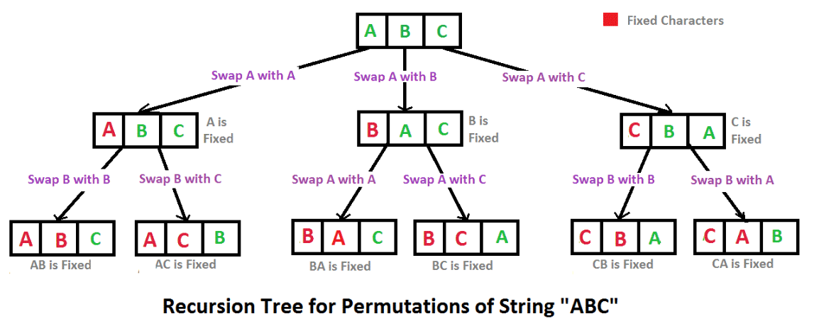

# 15. Permutations

## Description
~~~
Given a list of numbers, return all possible permutations.
You can assume that there is no duplicate numbers in the list.
~~~

**Example**
```
For nums = [1,2,3], the permutations are:

[
  [1,2,3],
  [1,3,2],
  [2,1,3],
  [2,3,1],
  [3,1,2],
  [3,2,1]
]

```
**Challenge**  
Can you do it in both recursively and iteratively?

## Link
[lintcode](https://www.lintcode.com/problem/permutations/)

## Method
1. DFS by recursion
   *  Key point: back tracking template. The recursion tree:  
    
2. DFS without recursion

3. BFS
key point: how to determine the neighbors in nums for a existing subset?   

4. Next Permutation

## Solution
1.1 DFS
~~~
class Solution {
public:
    /*
     * @param nums: A list of integers.
     * @return: A list of permutations.
     */
    vector<vector<int>> permute(vector<int> &nums) {
        // write your code here
        vector<vector<int>> answer;
        if (nums.size() == 0) {
            answer.push_back(vector<int>());
            return answer;
        }
        
        
        vector<int> oneanswer;

        permuteHelper(answer, oneanswer, nums);
        
        return answer;
    }

private:
    void permuteHelper(vector<vector<int>> &answer, vector<int> &oneanswer, vector<int> &nums) {
        if (oneanswer.size() == nums.size()) {
            answer.push_back(oneanswer);
            return;
        }
        
        for(int i = 0; i < nums.size(); i++) {
            // Or use visited[i] = true/false to record history
            if (find(oneanswer.begin(), oneanswer.end(), nums[i]) == oneanswer.end()) {
                oneanswer.push_back(nums[i]);
                permuteHelper(answer, oneanswer, nums);
                oneanswer.pop_back();
            }
        }
    }
    
    // Another solution
    void permuteHelper02(vector<vector<int>> &answer, vector<int> &nums, int pos) {
        
        // Is it a solution?
        if (pos == nums.size()) {
            answer.push_back(nums);
            return;
        }
        
        // Continue searching all other solutions
        for(int i = pos; i < nums.size(); i++) {
            swap(nums[i], nums[pos]);
            permuteHelper02(answer, nums, pos+1);
            swap(nums[i], nums[pos]);
        }
    }    
    
};
~~~

1.2 DFS (no recursion, not verfied)
~~~
// Non-Recursion
// version 1: Non-Recursion
class Solution {
public:
    /**
     * @param nums: A list of integers.
     * @return: A list of permutations.
     */
    vector<vector<int> > permute(vector<int> nums) {
        vector<vector<int> > permutations;
        if (nums.size() == 0) {
            permutations.push_back(vector<int>());
            return permutations;
        }
        
        int n = nums.size();
        vector<int> stack;
        bool inStack[n];
        for (int i = 0; i < n; i++) {
            inStack[i] = false;
        }
        
        stack.push_back(-1);
        while (stack.size() != 0) {
            // pop the last 
            int last = stack[stack.size() - 1];
            stack.pop_back();
            if (last != -1) {
                inStack[last] = false;
            }
            
            // increase the last, find the next bigger & avaiable number
            int next = -1;
            for (int i = last + 1; i < n; i++) {
                if (inStack[i] == false) {
                    next = i;
                    break;
                }
            }
            if (next == -1) {
                continue;
            }
            
            // generate the next permutation
            stack.push_back(next);
            inStack[next] = true;
            for (int i = 0; i < n; i++) {
                if (!inStack[i]) {
                    stack.push_back(i);
                    inStack[i] = true;
                }
            }
            
            // generate real permutation from index
            vector<int> permutation;
            for (int i = 0; i < n; i++) {
                permutation.push_back(nums[stack[i]]);
            }
            permutations.push_back(permutation);
        }
        
        return permutations;
    }
};
~~~

1.3 BFS

1.4 Non recursion: next permutation
~~~
class Solution {
public:
    /*
     * @param nums: A list of integers.
     * @return: A list of permutations.
     */
    vector<vector<int>> permute(vector<int> &nums) {
        // write your code here
        vector<vector<int>> answer;
        if (nums.size() == 0) {
            answer.push_back(vector<int>());
            return answer;
        }
        
        sort(nums.begin(), nums.end());
        
        for(;;) {
            answer.push_back(nums);
            // reverse find the first position where nums[i] < num[i+1]
            int i = nums.size() - 2;
            while(i >= 0 && nums[i] >= nums[i+1]) {
                i--;
            }
        
            if (i < 0) {
                return answer;
            }
        
            //reverse find the first position where nums[j] > nums[i]
            int j = nums.size() - 1;
            for(j = nums.size() - 1; j > i; j--) {
                if (nums[j] > nums[i]) {
                    break;
                }
            }    
        
            // switch nums[i] and nums[j]
            nums[i] ^= nums[j];
            nums[j] ^= nums[i];
            nums[i] ^= nums[j];
        
            reverse(nums.begin() + i + 1, nums.end() -1);
        }
        
        return answer;
    }
private:
    void reverse(vector<int>::iterator i1, vector<int>::iterator i2) {
        while(i1 < i2) {
            *i1 ^= *i2;
            *i2 ^= *i1;
            *i1 ^= *i2;
            i1++;
            i2--;
        }
    }
};
~~~

## Similar problems
[Permutations II](https://www.lintcode.com/problem/permutations-ii/)

## Tags
DFS  
BFS  
Next Permutation  
